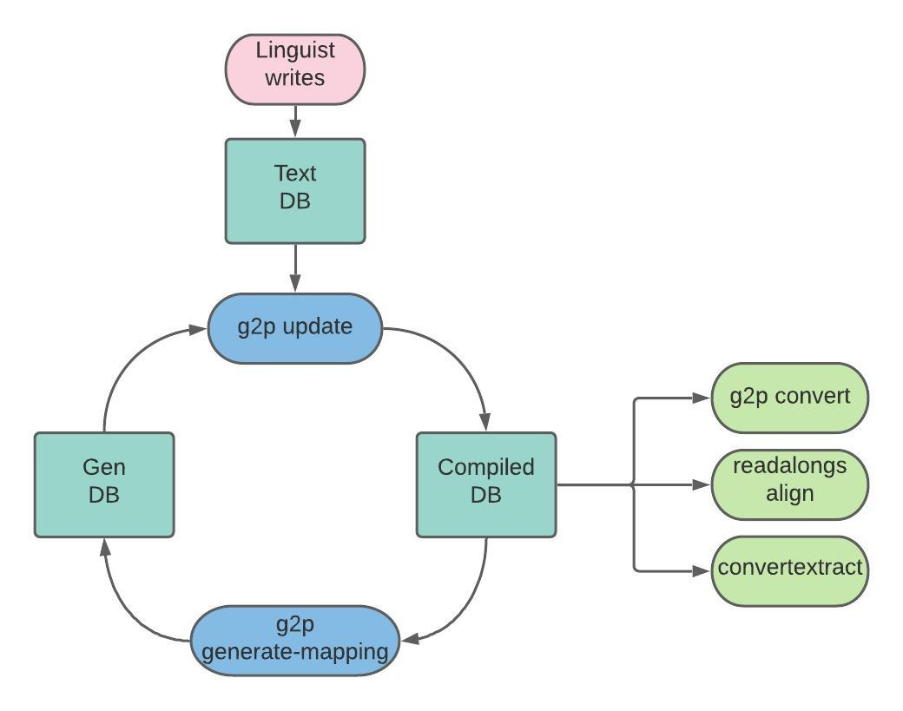

# Gᵢ2Pᵢ

[](https://codecov.io/gh/roedoejet/g2p)
[](https://roedoejet.github.io/g2p)
[](https://github.com/roedoejet/g2p/actions)
[](https://pypi.org/project/g2p/)
[](LICENSE)
[](https://github.com/roedoejet/g2p)

> Grapheme-to-Phoneme transformations that preserve input and output indices!

This library is for handling arbitrary conversions between input and output segments while preserving indices.


## Table of Contents
- [Gᵢ2Pᵢ](#gᵢ2pᵢ)
  - [Table of Contents](#table-of-contents)
  - [Background](#background)
  - [Install](#install)
  - [Usage](#usage)
  - [CLI](#cli)
    - [`update`](#update)
    - [`convert`](#convert)
    - [`generate-mapping`](#generate-mapping)
  - [Studio](#studio)
  - [Maintainers](#maintainers)
  - [Contributing](#contributing)
    - [Contributors](#contributors)
  - [How to Cite](#citation)
  - [License](#license)

See also:
  - [Gᵢ2Pᵢ documentation](https://roedoejet.github.io/g2p)
  - [7-part series on the Mother Tongues Blog](https://blog.mothertongues.org/g2p-background/)
  - [Gᵢ2Pᵢ Studio](https://g2p-studio.herokuapp.com)

## Background

The initial version of this package was developed by [Patrick Littell](https://github.com/littell) and was developed in order to allow for g2p from community orthographies to IPA and back again in [ReadAlong-Studio](https://github.com/dhdaines/ReadAlong-Studio). We decided to then pull out the g2p mechanism from [Convertextract](https://github.com/roedoejet/convertextract) which allows transducer relations to be declared in CSV files, and turn it into its own library - here it is! For an in-depth series on the motivation and how to use this tool, have a look at this [7-part series on the Mother Tongues Blog](https://blog.mothertongues.org/g2p-background/), or for a more technical overview, have a look at [this paper](https://aclanthology.org/2022.computel-1.7.pdf).

## Install

The best thing to do is install with pip `pip install g2p`.
This command will install the latest release published on [PyPI g2p releases](https://pypi.org/project/g2p/).

You can also use [hatch](https://hatch.pypa.io/latest/) (see [hatch
installation instructions](https://hatch.pypa.io/latest/install/)) to
set up an isolated local development environment, which may be useful
if you wish to contribute new mappings:

```sh
$ git clone https://github.com/roedoejet/g2p.git
$ cd g2p
$ hatch shell
```

You can also simply install an "editable" version with `pip` (but it
is recommended to do this in a [virtual
environment](https://docs.python.org/3/library/venv.html) or a [conda
environment](https://conda.io/projects/conda/en/latest/user-guide/tasks/manage-environments.html)):

```sh
$ git clone https://github.com/roedoejet/g2p.git
$ cd g2p
$ pip install -e .
```


## Usage

The easiest way to create a transducer is to use the `g2p.make_g2p` function.

To use it, first import the function:

`from g2p import make_g2p`

Then, call it with an argument for `in_lang` and `out_lang`. Both must be strings equal to the name of a particular mapping.

```python
>>> transducer = make_g2p('dan', 'eng-arpabet')
>>> transducer('hej').output_string
'HH EH Y'
```

There must be a valid path between the `in_lang` and `out_lang` in order for this to work. If you've edited a mapping or added a custom mapping, you must update g2p to include it: `g2p update`

### Writing mapping files

Mapping files are written as either CSV or JSON files.

#### CSV

CSV files write each new rule as a new line and consist of at least two columns, and up to four. The first column is required and corresponds to the rule's input. The second column is also
required and corresponds to the rule's output. The third column is optional and corresponds to the context before the rule input. The fourth column is also optional and corresponds to the context after the rule input. For example:

1. This mapping describes two rules; a -> b and c -> d.

```csv
a,b
c,d
```

2. This mapping describes two rules; a -> b / c _ d<sup id="a1">[1](#f1)</sup> and a -> e

```csv
a,b,c,d
a,e
```

The [g2p studio](https://g2p-studio.herokuapp.com) exports its rules to CSV format.

#### JSON

JSON files are written as an array of objects where each object corresponds to a new rule. The following two examples illustrate how the examples from the CSV section above would be written in JSON:

1. This mapping describes two rules; a -> b and c -> d.

```json
 [
   {
     "in": "a",
     "out": "b"
   },
   {
     "in": "c",
     "out": "d"
   }
 ]
```

2. This mapping describes two rules; a -> b / c _ d<sup id="a1">[1](#f1)</sup>  and a -> e

```json
 [
   {
     "in": "a",
     "out": "b",
     "context_before": "c",
     "context_after": "d"
   },
   {
     "in": "a",
     "out": "e"
   }
 ]
```

#### Python

You can also write your rules programatically in Python. For example:

```python
from g2p.mappings import Mapping, Rule
from g2p.transducer import Transducer

mapping = Mapping(rules=[
    Rule(rule_input="a", rule_output="b", context_before="c", context_after="d"),
    Rule(rule_input="a", rule_output="e")
  ])

transducer = Transducer(mapping)
transducer('cad') # returns "cbd"
```


## CLI

### `update`

If you edit or add new mappings to the `g2p.mappings.langs` folder, you need to update `g2p`. You do this by running `g2p update`

### `convert`
If you want to convert a string on the command line, you can use `g2p convert <input_text> <in_lang> <out_lang>`

Ex. `g2p convert hej dan eng-arpabet` would produce `HH EH Y`

If you have written your own mapping that is not included in the standard `g2p` library, you can point to its configuration file using the `--config` flag, as in `g2p convert <input_text> <in_lang> <out_lang> --config path/to/config.yml`. This will add the mappings defined in your configuration to the existing `g2p` network, so be careful to avoid namespace errors.

### `generate-mapping`
If your language has a mapping to IPA and you want to generate a mapping between that and the English IPA mapping, you can use `g2p generate-mapping <in_lang> --ipa`.  Remember to run `g2p update` before so that it has the latest mappings for your language.

Ex. `g2p generate-mapping dan --ipa` will produce a mapping from `dan-ipa` to `eng-ipa`. You must also run `g2p update` afterwards to update `g2p`. The resulting mapping will be added to the folder in `g2p.mappings.langs.generated`

Note: if your language goes through an intermediate representation, e.g., lang -> lang-equiv -> lang-ipa, specify both the `<in_lang>` and `<out_lang>` of your final IPA mapping to `g2p generate-mapping`. E.g., to generate `crl-ipa -> eng-ipa`, you would run `g2p generate-mapping --ipa crl-equiv crl-ipa`.

### g2p workflow diagram

The interactions between `g2p update` and `g2p generate-mapping` are not fully intuitive, so this diagram should help understand what's going on:



Text DB: this is the textual database of g2p conversion rules created by contributors. It consists of these files:
* g2p/mappings/langs/\*/\*.csv
* g2p/mappings/langs/\*/\*.json
* g2p/mappings/langs/\*/\*.yaml

Gen DB: this is the part of the textual database that is generated when running the `g2p generate-mapping` command:
* g2p/mappings/generated/\*

Compiled DB: this contains the same info as Text DB + Gen DB, but in a format optimized for fast reading by the machine. This is what any program using `g2p` reads: `g2p convert`, `readalongs align`, `convertextract`, and also `g2p generate-mapping`. It consists of these files:
* g2p/mappings/langs/langs.json.gz
* g2p/mappings/langs/network.json.gz
* g2p/static/languages-network.json

So, when you write a new g2p mapping for a language, say `lll`, and you want to be able to convert text from `lll` to `eng-ipa` or `eng-arpabet`, you need to do the following:
1. Write the mapping from `lll` to `lll-ipa` in g2p/mappings/langs/lll/. You've just updated Text DB.
2. Run `g2p update` to regenerate Compiled DB from the current Text DB and Gen DB, i.e., to incorporate your new mapping rules.
3. Run `g2p generate-mapping --ipa lll` to generate g2p/mappings/langs/generated/lll-ipa\_to\_eng-ipa.json. This is not based on what you wrote directly, but rather on what's in Generated DB.
4. Run `g2p update` again. `g2p generate-mapping` updates Gen DB only, so what gets written there will only be reflected in Compiled DB when you run `g2p update` once more.

Once you have the Compiled DB, it is then possible to use the `g2p convert` command, create time-aligned audiobooks with [readalongs align](https://github.com/ReadAlongs/Studio), or convert files with the [convertextract](https://github.com/roedoejet/convertextract) library.

## Studio

You can also run the `g2p Studio` which is a web interface for
creating custom lookup tables to be used with g2p. To run the `g2p
Studio` either visit https://g2p-studio.herokuapp.com/ or run it
locally with `python run_studio.py`.

## API for Developers

There is also a REST API available for use in your own applications.
To launch it from the command-line use `python run_studio.py` or
`uvicorn g2p.app:APP`.  The API documentation will be viewable
(with the ability to use it interactively) at
http://localhost:5000/api/v1/docs - an OpenAPI definition is also available
at http://localhost:5000/api/v1/openapi.json .

## Maintainers

[@roedoejet](https://github.com/roedoejet).
[@joanise](https://github.com/joanise).


## Contributing

Feel free to dive in! [Open an issue](https://github.com/roedoejet/g2p/issues/new) or submit PRs.

This repo follows the [Contributor Covenant](http://contributor-covenant.org/version/1/3/0/) Code of Conduct.

Have a look at [Contributing.md](Contributing.md) for help using our standardized formatting conventions and pre-commit hooks.

### Adding a new mapping

In order to add a new mapping, you have to follow the following steps.

1. Determine your language's [ISO 639-3 code](https://en.wikipedia.org/wiki/List_of_ISO_639-3_codes).
2. Add a folder with your language's ISO 639-3 code to `g2p/mappings/langs`
3. Add a configuration file at `g2p/mappings/langs/<yourlangISOcode>/config-g2p.yaml`. Here is the basic template for a configuration:

```yaml
<<: &shared
  language_name: <This is the actual name of the language>
mappings:
  - display_name: This is a description of the mapping
    in_lang: This is your language's ISO 639-3 code
    out_lang: This is the output of the mapping
    type: mapping
    authors:
      - <YourNameHere>
    rules_path: <FilenameOfMapping>
    <<: *shared
```

4. Add a mapping file. Look at the other mappings for examples, or visit the [g2p studio](https://g2p-studio.herokuapp.com) to practise your mappings.
Mappings are defined in either a CSV or json file. See [writing mapping files](#writing-mapping-files) for more info.
5. Start a development shell with `hatch shell` (or install an editable version with `pip install -e .`) then update with `g2p update`
6. Add some tests in `g2p/testspublic/data/<YourIsoCode>.psv`. Each line in the file will run a test with the following structure: `<in_lang>|<out_lang>|<input_string>|<expected_output>`
7. Run `python3 run_tests.py langs` to make sure your tests pass.
8. Make sure you have [checked all the boxes](https://github.com/roedoejet/g2p/blob/main/.github/pull_request_template.md) and make a [pull request]((https://github.com/roedoejet/g2p/pulls)!

### Adding a new language for support with ReadAlongs

This repo is used extensively by [ReadAlongs](https://github.com/ReadAlongs/Studio). In order to make your language supported by ReadAlongs, you must add a mapping from your language's orthography to IPA. So, for example, to add Danish (ISO 639-3: `dan`), the steps above must be followed. The `in_lang` for the mapping must be `dan` and the out_lang must be suffixed with 'ipa' as in `dan-ipa`. The following is the proper configuration:

```yaml
mappings:
  - display_name: Danish to IPA
    language_name: Danish
    in_lang: dan
    out_lang: dan-ipa
    type: mapping
    authors:
      - Aidan Pine
    rules_path: dan_to_ipa.csv
    abbreviations_path: dan_abbs.csv
    rule_ordering: as-written
    case_sensitive: false
    norm_form: 'none'
```

Then, you can generate the mapping between `dan-ipa` and `eng-ipa` by running `g2p generate-mapping --ipa`. This will add the mapping to `g2p/mappings/langs/generated` - do not edit this file, but feel free to have a look. Then, run `g2p update` and submit a [pull request](https://github.com/roedoejet/g2p/pulls), and tada! Your language is supported by ReadAlongs as well!


#### Footnotes

<b id="f1">1</b> If this notation is unfamiliar, have a look at [phonological rewrite rules](https://en.wikipedia.org/wiki/Phonological_rule#:~:text=Phonological%20rules%20are%20commonly%20used,or%20distinctive%20features%20or%20both.) [↩](#a1)


### Contributors

This project exists thanks to all the
[people who contribute](https://github.com/roedoejet/g2p/graphs/contributors).

## Citation

If you use this work in a project of yours and write about it, please cite us using the following:

Aidan Pine, Patrick Littell, Eric Joanis, David Huggins-Daines, Christopher Cox, Fineen Davis, Eddie Antonio Santos, Shankhalika Srikanth, Delasie Torkornoo, and Sabrina Yu. 2022. [Gᵢ2Pᵢ Rule-based, index-preserving grapheme-to-phoneme transformations Rule-based, index-preserving grapheme-to-phoneme transformations](https://aclanthology.org/2022.computel-1.7). In _Proceedings of the Fifth Workshop on the Use of Computational Methods in the Study of Endangered Languages_, pages 52–60, Dublin, Ireland. Association for Computational Linguistics.

Or in BibTeX:

```
@inproceedings{pine-etal-2022-gi22pi,
    title = "{G}$_i$2{P}$_i$ Rule-based, index-preserving grapheme-to-phoneme transformations",
    author = "Pine, Aidan  and
      Littell, Patrick  and
      Joanis, Eric  and
      Huggins-Daines, David  and
      Cox, Christopher  and
      Davis, Fineen  and
      Antonio Santos, Eddie  and
      Srikanth, Shankhalika  and
      Torkornoo, Delasie  and
      Yu, Sabrina",
    booktitle = "Proceedings of the Fifth Workshop on the Use of Computational Methods in the Study of Endangered Languages",
    month = may,
    year = "2022",
    address = "Dublin, Ireland",
    publisher = "Association for Computational Linguistics",
    url = "https://aclanthology.org/2022.computel-1.7",
    pages = "52--60",
    abstract = "This paper describes the motivation and implementation details for a rule-based, index-preserving grapheme-to-phoneme engine {`}G$_i$2P$_i$' implemented in pure Python and released under the open source MIT license. The engine and interface have been designed to prioritize the developer experience of potential contributors without requiring a high level of programming knowledge. {`}G$_i$2P$_i$' already provides mappings for 30 (mostly Indigenous) languages, and the package is accompanied by a web-based interactive development environment, a RESTful API, and extensive documentation to encourage the addition of more mappings in the future. We also present three downstream applications of {`}G$_i$2P$_i$' and show results of a preliminary evaluation.",
}
```

## License

MIT. See [LICENSE](LICENSE) for the Copyright and license statements.
