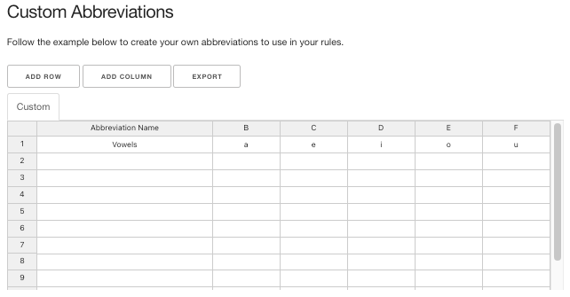

# Studio

The g2p studio is intended to make the process of writing rules easier.

You can either visit the [autobuilt version](https://g2p-studio.herokuapp.com/) or spin it up on your machine
using the `run_studio.py` script in the root directory (`python run_studio.py`)

## Basic use

The basic use of the g2p studio shows two text areas where the left one is input and the right one is output. If you type in the left text area, the rules of your chosen mapping will be applied and printed in the right text area.

### Settings

There are seven settings:

- Rules are case sensitive
- Escape special characters
    * This setting escapes special Regular Expression characters like slashes and dollar signs
- Rule Ordering Approach
    - "As written" - rules are evaluated in the order they are written
    - "Longest first" - rules are first sorted according to length
- Reverse the rules
- Prevent all rules from feeding - this makes it so that after a rule has applied on one or more characters, those characters cannot be affected by any rule that follows. This can also be specified on a per-rule basis.
- Unicode Normalization - choose from "none", "NFC", "NFD", "NKFC", or "NKFD"
- Output delimiter - specify a delimiter to be inserted after a rule is applied

## Custom rules

Rules are added by adding a row of data for each rule. For example, to make a rule that turns all instances of 'a' into 'b', you would put 'a' in the 'in' column and 'b' in the 'out' column.
Context before and context after declares if there is any context required for the rule to apply. For example to turn 'a' into 'b' only when it is followed by 'c' you would put 'a' in the 'in' column, 'b', in the 'out' column and 'c' in the 'context_after' column. You can also select "prevent feeding" for a rule to prevent any subsequent rules from applying after the rule in-question has been applied.

## Custom Abbreviations

Sometimes you might want to write more complicated rules like, turn 'a' into 'b' when it is followed by a vowel. Here you could put 'a|e|i|o|u' in the 'context_after' column of that rule, or you could simply declare an 'abbreviation' or variable.
To write an abbreviation, put the name of the abbreviation in the first column of the 'Custom Abbreviations' section, and every character that it abbreviates in the following columns. See below for the `Vowels` example. Now, we can write our rule with just 'Vowels' in the 'context_after' column.

## Rule Creator

Instead of writing rules individually, we can use the 'Rule Creator' visual programming aid to write rules. You can fit the blocks together and then click 'add to rules' to add them to your rules.
The example below demonstrates blocks that will add rules that turn each vowel in the Vowels abbreviation into 'A'

